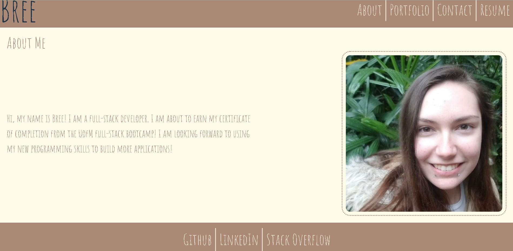
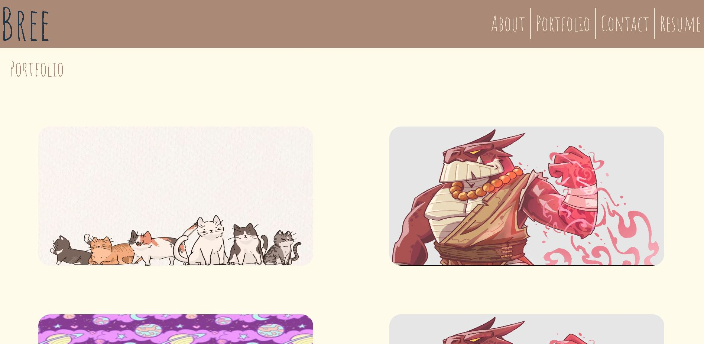
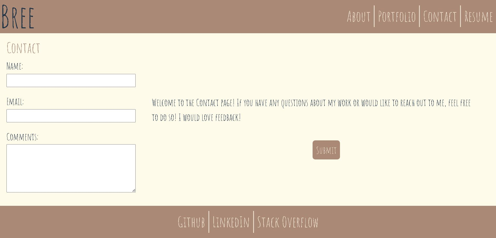
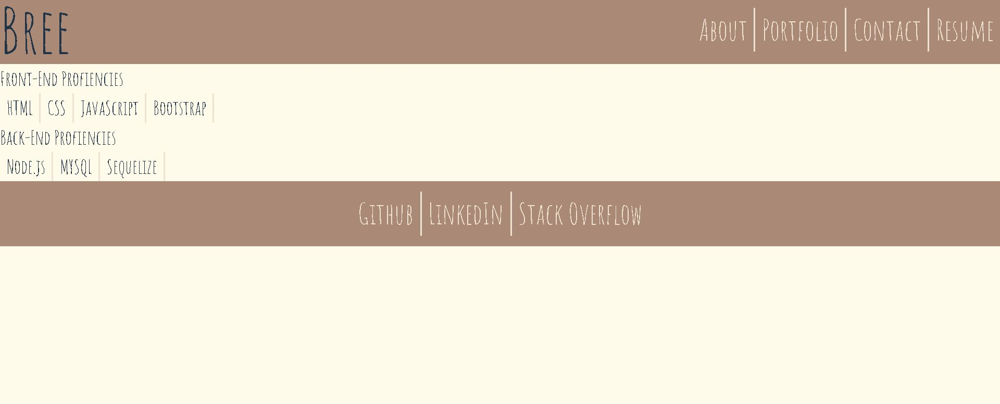

# React-Portfolio

## Description

This project is an updated version of my original portfolio, this time using React! 

## Usage

I couldn't get my website deployed. 

To use this site, you can click on the links on the navbar to switch between different pages. The links at the bottom will take you to the represented websites. Currently the portfolio links are not working and the resume is not downloadable.

## Credits

[React-Router External Link](https://stackoverflow.com/questions/42914666/react-router-external-link) from stackoverflow

[Style root element using css file, but not working](https://stackoverflow.com/questions/56202718/style-root-element-using-css-file-but-not-working) from stackoverflow

[How do I add validation to the form in my React component?](https://stackoverflow.com/questions/41296668/how-do-i-add-validation-to-the-form-in-my-react-component)

[Click outside element event using React Hooks](https://medium.com/@kevinfelisilda/click-outside-element-event-using-react-hooks-2c540814b661)

[Regex Magic in React: Unleashing the Potential of Pattern Matching](https://medium.com/@stheodorejohn/regex-magic-in-react-unleashing-the-potential-of-pattern-matching-82d90a5afb16)